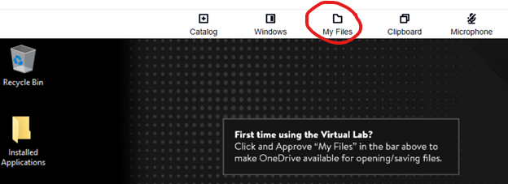
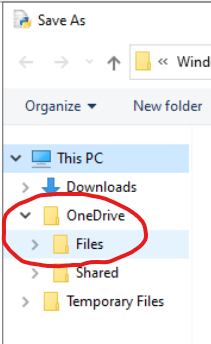

## In-class activity: Run a Python program in IDLE on a Dickinson Virtual Lab machine

1. Go to [https://www.dickinson.edu/virtual](https://www.dickinson.edu/virtual). This is the Dickinson Virtual Lab.

2. Click on the `Python` link.

3. Make OneDrive available in your Virtual Lab machine. (You will only have to do this once. In future when you access the Virtual Lab, OneDrive will automatically be available.) Click and approve My Files in the bar above the main desktop display:
            

4. In the Windows search bar (bottom left), search for `IDLE` and choose `IDLE Python 3.13 64-bit`.

5. Use `File | New File` to create a new file. This will be a _Python source code file_ containing our first Python program. Python files should have a name that ends in `.py`. Before typing the program in, save the file using `File | Save As...`. Name the file `greetings.py`, and save it in your `class01` folder on OneDrive. OneDrive should be available under `This PC`:   



6. Type or paste this Python code into your file:  
        ```print("Greetings. I wonder if COMP130 will be fun AND useful AND enriching.")```  
   Save the file, then run the program via `Run | Run Module`.

7.  If you have time, paste in more code and experiment with it. For example, try this:

```
topic = input('What is/was your first year seminar topic? ')
print('Nice!!', topic, 'sounds interesting.')
```
Or this:
```
import math
x = math.sqrt(2)
print("By the way, did you know that the square root of 2 is", x, "?")
```
Or this:
```
a = 7
b = 24
c = a + b
print("Also, the sum of", a, "and", b, "is", c)
```

Don't worry if you don't understand the code. We'll learn all about it this semester.
