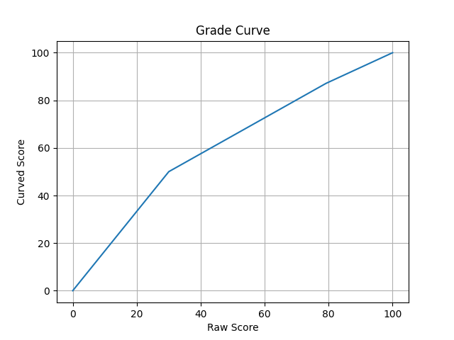

# Explanation of Lab Exam 2 curving

The curve was a piecewise linear function with the following properties: 0 maps to 0, 30 maps to 50, 79 maps to 87, 100 maps to 100. These values were chosen so that the raw median of 79 would map to B+ (87%, a fair reflection of achievements of the median student) and my estimate that scoring 30 points represented achieving about half of the learning goals (hence 30->50). The Python function implementing this (written by an AI assistant) is:
```
def curved_percentage(raw_percent):
    """
    Apply the piecewise linear curve to a score in percent (0–100).
    """

    x = raw_percent

    if x <= 0:
        return 0.0
    if x >= 100:
        return 100.0

    # Segment 1: 0 → 30 maps 0 → 50
    if x <= 30:
        return (x / 30) * 50.0

    # Segment 2: 30 → 79 maps 50 → 87
    if x <= 79:
        slope = (87 - 50) / (79 - 30)
        return 50 + slope * (x - 30)

    # Segment 3: 79 → 100 maps 87 → 100
    slope = (100 - 87) / (100 - 79)
    return 87 + slope * (x - 79)
```

Here's a graph of this function:
