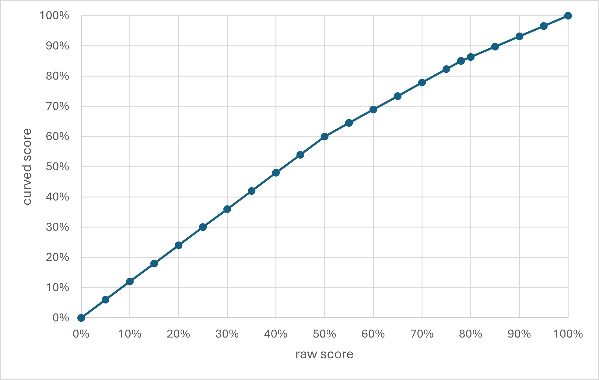

# Explanation of Final Exam curving

The curve was a piecewise linear function with the following properties: 0 maps to 0, 50 maps to 60, 78 maps to 85, 100 maps to 100. These values were chosen so that the raw median of 78 would map to B (85%, a fair reflection of achievements of the median student) and my estimate that scoring 50% represented a passing score (hence 50->60). 

Here's a graph of this function:
