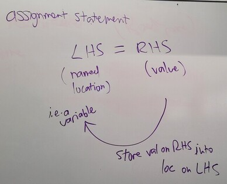

# Detailed schedule and resources

## Class 26

* Code for string indexing, slices, and iteration:
  - [string_practice.py](class26/string_practice.py)
  - [string_practice_completed.py](class26/string_practice_completed.py)

## Class 25

* Code for practicing debugging:
  - [debug_practice.py](class25/debug_practice.py)
  - [debug_practice_completed.py](class25/debug_practice_completed.py)

Note: `debug_practice_completed.py` uses _f-strings_, also known as _formatted string literals_, for printing out the values of variables. This is an optional concept. See the Python documentation on [Fancier Output Formatting](https://docs.python.org/3/tutorial/inputoutput.html) for details.

## Class 24

Announcements:

* happy 🌼 🌱 spring
* Eid Mubarak 😊
* feedback discussion 
* hw6, qu9 -- need `print('test_get_price succeeded')` at the end of the test function
* [MUSIC LEAGUE!!!!](https://app.musicleague.com/l/b18ea3de85f444b2ae41ac62c59f1b69/) -- submit a weird song today
  - Incentive: I will perform one of my music league submissions on ukulele if 10 or more people submit and vote this round.

Today's class:

* In this class we examine two examples of interesting
  _algorithms_: 
  1. finding square roots using [Newton's method](https://en.wikipedia.org/wiki/Newton%27s_method) (scroll to "Use of Newton's method to compute square roots" on that page)
  2. solving an equation using the [bisection
     method](https://en.wikipedia.org/wiki/Bisection_method).
* _Note that detailed knowledge of these algorithms is not required for
  this course. These are just intended as interesting examples, to
  demonstrate the power of what we have already learned this
  semester. You are not required to memorize Newton's method or the
  bisection method._
* Example code:
  - [square_root.py](class24/square_root.py)
  - [solve_by_bisection.py](class24/solve_by_bisection.py)
  - [solve_by_bisection_completed.py](class24/solve_by_bisection_completed.py)

## Class 23

<!-- Feedback results: suggestion for how to get more practice problems -- use an AI assistant: [example using Google Gemini](https://gemini.google.com/share/55911b2a260f) -->

* Code for demonstrating while loops:
  - [while_loops.py](class23/while_loops.py)
  - [while_loops_solution.py](class23/while_loops_solution.py)
  - [practice_killing_python.py](class23/practice_killing_python.py)

## Class 22

* Please complete the anonymous [mid-semester survey](https://forms.office.com/r/CJCw5vhmix).
* Code for demonstrating test functions:
  - [test_demo.py](class22/test_demo.py)
  - [test_demo_completed.py](class22/test_demo_completed.py)

## Class 21

* Code for examples of recursion with return values:
  - [fruitful_recursion.py](class21/fruitful_recursion.py)
  - [recursion_practice.py](class21/recursion_practice.py)

## Class 20

* Code for functions with return values:
  - [make_cheer.py](class20/make_cheer.py)
  - (don't look yet) [make_cheer_completed.py](class20/make_cheer_completed.py)

* [code on toast](https://code-on-toast.vercel.app/) for submitting your code snippets

## Class 19

* overview of exam solutions (available on Moodle)
* Advising discussion for course selection. Please see the [notes on course selection](class19/course-selection.docx).
* Code introducing the idea of recursion: [recursion_example.py](class19/recursion_example.py)

## Class 18

Written exam 1

## Class 17

Exam review -- bring questions to discuss.

## Class 16

Social/Ethical class III: Social good in computing.  The article for discussion is available on the Readings web page.

* We need a volunteer note-taker for today.
* The class is divided into two separate discussions:
  1. Discussion of false dichotomies in computing, based on the assigned reading.
  2. Discussion of _open-source software_ (OSS, FOSS, H/FOSS) based on in-class research done in pairs. Software projects to be discussed:
    - Linux
    - MySQL
    - Apache HTTP Server
    - OpenMRS
    - OpenStreetMap

## Class 15

Code for demonstrating guardians:
* [no_guardian.py](class15/no_guardian.py)
* [guardian.py](class15/guardian.py)

## Class 14

Code for demonstrating and encapsulation and generalization:
* [top_level_code.py](class14/top_level_code.py)
* [encapsulate.py](class14/encapsulate.py)
* [generalize.py](class14/generalize.py)

Code for demonstrating factoring out repeated code:
* [repeated.py](class14/repeated.py)
* [factored_out.py](class14/factored_out.py)

## Class 13

Social/Ethical discussion II. 
* See Readings web page.
* You are expected read the assigned content carefully and take a few handwritten notes that you can bring to class and refer to during our device-free discussion.
* We need a volunteer note taker for today.

## Class 12

Warmup: Draw the stack diagram for the program [callstack_warmup.py](./class12/callstack_warmup.py) in the following situations:  
(a)	Immediately before line 12 is executed  
(b)	Immediately before line 8 is executed  

Announcement:
* The reading for Monday is available on the Readings page.
* For this type of discussion class, you are expected read the assigned content carefully and take a few handwritten notes that you can bring to class and refer to during our device-free discussion.
 
Topics for today's class:
* Informal discussion of the *scope* of a variable: most variables and parameters are *local*.
* Review of call stack and debugging. Add the ability to step in, step over, step out.
* Printing on the same line from multiple `print()` statements.
* Mini-lab (ungraded):
  - Using the [callstack_demo.py](class11/callstack_demo.py) program from last time, set a breakpoint in one of the functions. Practice running up to that point in the debugger and examining the local variables in each frame of the call stack. Now practice stepping statement by statement to the end of the program observing changes in the call stack and its local variables. Ask for help if you run into any problems.

## Class 11

Demo code: [debug_demo.py](class11/debug_demo.py), [callstack_demo.py](class11/callstack_demo.py)

## Class 10

Social/Ethical discussion I. See Readings web page.

<!-- * We need a volunteer note taker for today. -->
* Notes provided by volunteer note taker (thank you Dylan!): [comp130notes-2-9-2026.jpg](https://lms.dickinson.edu/mod/resource/view.php?id=1384715) -- Also available on Moodle.

## Class 9

Announcements about homework:

1. Don’t comment out code when turning in solutions any more. We will encapsulate code in functions instead.
2. For homework, make sure to write your code in IDLE and test it. When it’s working perfectly, then copy and paste it into your homework document.
3. For homework, if using Microsoft Word, start with the assignment document. Then you can format the code by using the “code” style. If you get a lot of space between the lines, then use “Remove Space After Paragraph” (select text, maybe right click, look for line spacing option).
4. Make sure your code is in a fixed width font like Consolas or Courier. (Why??)

Introductions: 2nd row, get ready

Today is mostly review of chained and nested conditional statements. We want to write a function `decide(hungry, tired)` that prints output according to

|               | hungry      | not hungry    |
| ------------- | ----------- | ------------- |
| **tired**     | get takeout | sleep         |
| **not tired** | cook dinner | watch Netflix |

Example code: (try to figure out for yourself first, don't peek unless you need to) [decide.py](class09/decide.py)

Also Boolean variables and parameters -- see SSG12.

## Class 8

Today we cover chained conditional statements and nested conditional
statements. 

Solution to warmup exercise: [warmup.py](./class08/warmup.py).

Additional example (Not covered in class): [convert_miles2.py](class08/convert_miles2.py)

We will also go over sections 9 to 11 of the supplementary study guide, which are needed for lab this week.

Complete example for using `graphics.py` with familiar coordinate system: [graphics_example.py](./class08/graphics_example.py)

## Class 7

More introductions: front row, get ready with your first-year seminar topic and instructor and what you liked about the course.

Today we cover topics from the assigned textbook reading, including floor division and modulus, boolean expressions, relational operators (`==`, `!=`, `>`, `>=` etc.), logical operators (`and`, `or`, `not`), conditional execution (`if`, `else`).

Example Python code (but try to do the warmup exercise yourself before looking at this): [convert_miles.py](class07/convert_miles.py), [boolean_demos.py](class07/boolean_demos.py)

## Class 6

Announcements: 
* Please be aware of and make use of all the opportunities to get help in this course. See the main homepage "How do I get help in this course?" link.
* Homework solutions are available on Moodle.
* This is how to interpret graded homework assignments:
  - First, remember that only a random subset of questions are graded. Second, usually some points are awarded for completeness (i.e. reasonable attempts at the questions that were not graded). The score written on your homework will look something like "14/14 + 10c = 24/24". That means the graded questions were worth a total of 14 points and you scored 14/14. In addition, 10 points were awarded for completeness. Your total score was 24/24. So, the letter "c" in "10c" stands for "completeness".

Today we cover Sections 4-8 of the supplementary study guide: nested `for` loops; `range()`; constructors; `graphics.py`; methods and dot notation.

Code: [graphics_demo.py](class06/graphics_demo.py), [grid.py](class06/grid.py); other code from today was copied directly from the study guide.

## Class 5

Agenda for today's class:

1. In-class exercise to build familiarity with for loops:
   - A. (warmup) Write code that prints out the result of rolling a 20-sided dice.
   - B. Write code that prints out the results of rolling a 20-sided dice 100 times.
   - C. Write code that computes and prints the average value of the rolls in the previous simulation (rolling a 20-sided dice 100 times).
2. We'll go over the supplementary study guide content about `for`
   loops, which explains how to use the loop variable.
3. Run a basic turtle program.

Useful tip: Learn how to use IDLE's Indent Region and Dedent Region
features, in the Format menu.

Code (suggest don't peek): [roll_dice_once.py](class05/roll_dice_once.py), [roll_dice_100times.py](class05/roll_dice_100times.py), [average_100_rolls.py](class05/average_100_rolls.py), [draw_square.py](class05/draw_square.py)

Assignment statement explanation:

## Class 4

Important note about the teaching style in this course: Many concepts
will not be covered during our lecture session. It is essential to
read the textbook carefully and ask questions on any content you don't
understand. For example, the assigned reading for Class 3 included the
important concept of _comments_, but we did not discuss
that during class.

Plan for today: We will go over some key concepts from the assigned
reading, especially how to define new functions and how to generate
random numbers.

Code: [border.py](class04/border.py), [roll_dice.py](class04/roll_dice.py)

## Class 3

_If campus is closed on Monday, class will take place online via Zoom. The link and details are on the course home page._

- Make sure that you have Show File Extensions turned on in your
  operating system. For example, you must be able to see the `.py` at
  the end of your Python files, when browsing folders.
- When opening a Python file, do not just double-click on it in the
  folder view. First open the IDLE application, then use the Open
  command in the File menu.

Today we review the concepts in the assigned reading, including: variable names, keyword, import, dot operator, statement, expression, evaluation, execution, argument, comment, function definition, header, body, parameter

Example programs (suggestion: don't peek before class): [area.py](class03/area.py), [ask_question.py](class03/ask_question.py)

## Class 2

1. Answer questions on syllabus. Especially note the 5 exam dates.

2. Demo: AI can easily do your homework assignments. But it's a really bad idea to rely on it, because you won't have AI in the exams.

3. Interactive textbook: You can interact with the textbook by reading it in the form of _Jupyter notebooks_. Links to the notebooks are on the very first page of the textbook.

4. We will review concepts in the assigned reading, including some of the following: arithmetic operator, type (this is what I usually call a _datatype_), expression, function, function call, bugs and debugging, variable, assignment statement, state diagram, `input()`.

5. [If time allows.] Play with some more Python progams (see suggestions in class 1).

## Class 1

**Announcement:** This class separates into two separate sections for labs: COMP130-01 on Fridays 3-5pm and COMP130-02 on Wednesdays 3-5pm. Currently there are significantly more students signed up for the Wednesday section. If you would like to switch to the Friday section (and thus receive more individualized help from the instructor and quantitative reasoning associate), please drop your current section and add yourself to the other section. 

- [In-class activity: Create COMP130 folder on OneDrive](class01/onedrive.md)

- [In-class activity: Run a Python program in IDLE](class01/first-python-program.md)

- Please read the syllabus carefully and bring any questions to the
  next class.

- Note the required reading: complete this before the next class.

- Note when the first homework assignment is due.
